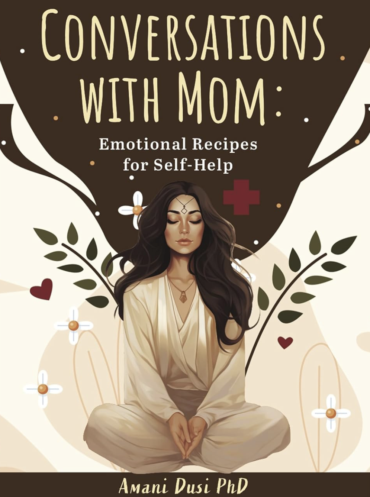

> [!TIP] **Available Now!** 
> Get your copy today from 
>  Amazon 

**Conversations with Mom: Emotional Recipes for Self-Help** is more than a memoir. It's a fusion of 
profound exchanges, timeless wisdom, and the aromatic essence of cultural heritage. 
Step into the intimate conversations between a mother and her adult daughter as ordinary moments of 
folding laundry and making dinner transform into extraordinary life lessons.




This collection of heartwarming essays captures the essence of <b>conversations between a 
mother and her grown daughter as they navigate motherhood and self-discovery</b>. 
Through comforting advice and powerful tools exchanged during everyday activities, the 
daughter's perspective is gently molded, offering readers a refreshing lens through which to view life's challenges.



<ul>
  <li>Cherish meaningful family <b>relationships</b></li>
  <li>Seek <b>wisdom</b> from lived experiences</li>
  <li>Enjoy <b>cultural</b> storytelling</li>
  <li>Want practical <b>life guidance</b></li>
  <li>Love memoirs that teach and <b>inspire</b></li>
</ul>




<ul>
    <li><b> Mother-Daughter Bond</b>: Explore the deep connection between generations and how wisdom passes from mother to child through everyday moments.</li>
    <li><b>Self-Discovery Tools</b>: Discover practical approaches to personal growth through the comforting guidance shared between family members. </li>
    <li><b>Cultural Heritage</b>: Experience exotic recipes that serve as metaphors for life lessons and connect readers to rich cultural traditions. </li>
    <li><b>Life Perspective</b>: Gain fresh insights on viewing challenges through the lens of shared family wisdom and experience.</li>
</ul>





