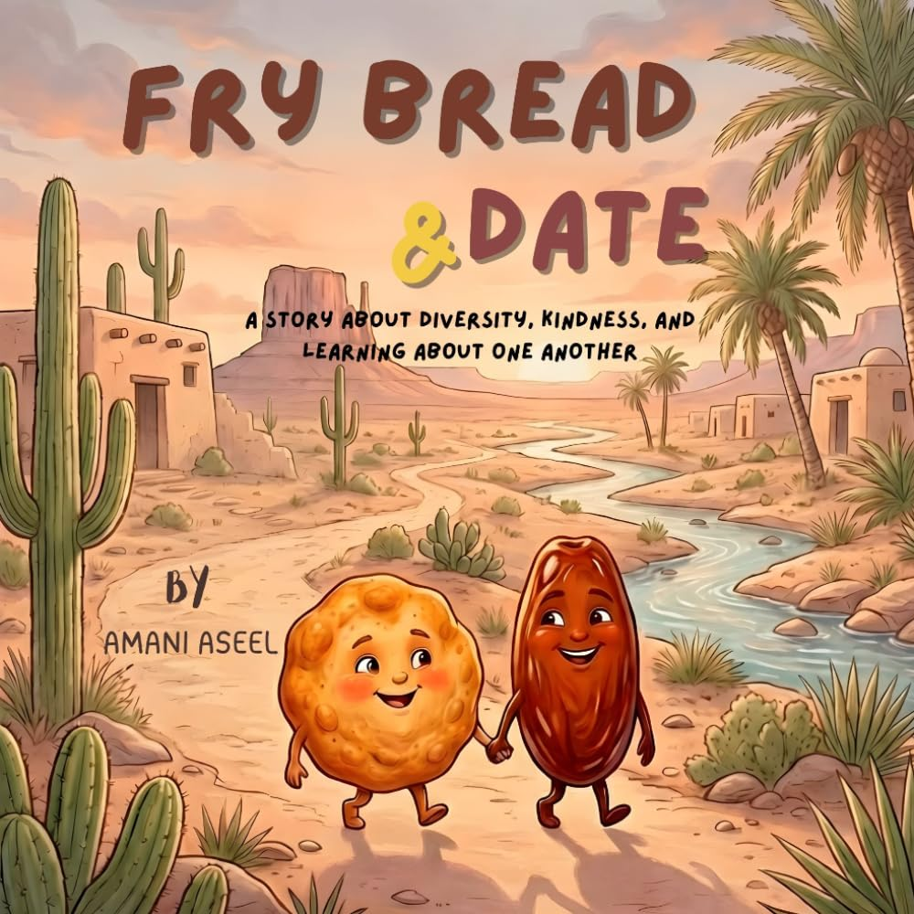

> [!TIP] **Available Now!** 
> Get your copy today from 
>  Amazon 

**Frybread and Date**, two foods from different cultures meet for the first time and believe they are very different from one another. Frybread comes from warm family kitchens filled with stories and tradition, while Date comes from sunny groves far across the world where families gather and celebrate together.

As they share their stories, songs, and traditions, they begin to discover how much they truly have in common. Both are made with love, shared with family, and bring comfort and joy to the people around them. Through kindness, curiosity, and respect, Frybread and Date learn that differences should be celebrated, not feared.

In the end, they realize that although people, foods, and cultures may look different on the outside, our hearts are often wonderfully alike. Their friendship teaches children that diversity makes the world richer, and that love and respect can bring everyone together.




Frybread & Date is a heartwarming celebration of friendship across cultures, told through the unexpected meeting of two beloved foods. Frybread arrives carrying the warmth of family kitchens and generations of tradition, while Date brings the sunshine of faraway groves and the joy of festive gatherings. At first, they see only their differences — but as they share their stories, songs, and traditions with one another, Frybread and Date discover something wonderful: both are made with love, both are shared with family, and both bring comfort to everyone around them. With curiosity, kindness, and respect, this gentle story shows children that our differences are something to celebrate, not fear — and that no matter how different we may look on the outside, our hearts are often beautifully alike.



<ul>
  <li>Celebrate <b>cultural diversity</b> and want to share that value with their child</li>
  <li>Are navigating experiences of <b>feeling different</b> or left out </li>
  <li>Want to inspire <b>empathy and respect</b> in young readers</li>
  <li>Love stories that spark <b>meaningful conversations</b> at home or in the classroom</li>
  <li>Believe in the power of <b>kindness</b> to build bridges between people</li>
</ul>




<ul>
    <li><b>Cultural pride</b>: children are encouraged to be proud of their heritage and the traditions of home. </li>
    <li><b>Empathy and perspective-taking</b>: the story invites readers to see the world through someone else's eyes before judging. </li>
    <li><b>Every family is special </b>: the message that love looks different in every home, and that's something to celebrate. </li>
    <li><b>Inclusion and belonging</b>: the world becomes a richer, kinder place when everyone's story is welcomed. </li>
</ul>





