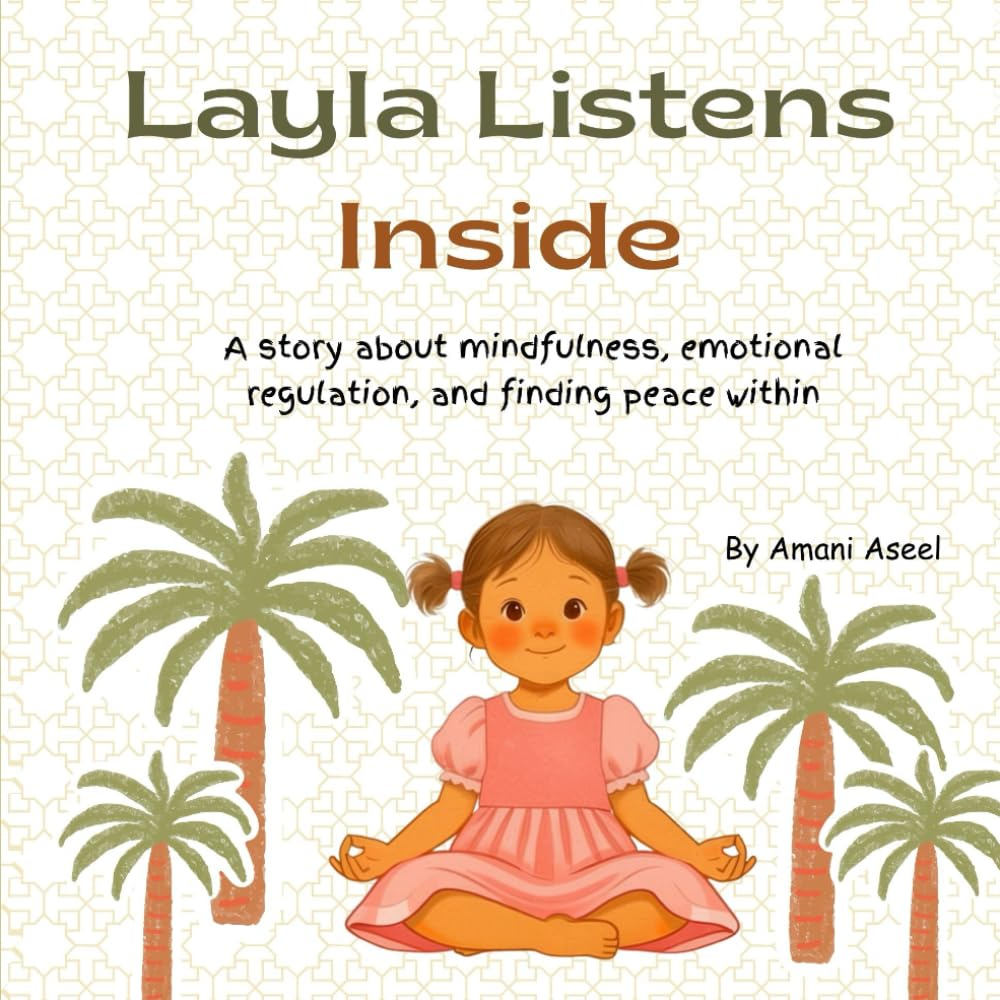

> [!TIP] **Available Now!** 
> Get your copy today from 
>  Amazon 

**Layla Listens Inside** is a story about mindfulness, emotional regulation, and finding peace within.

Layla is a bright little girl with a very busy mind. When her thoughts bounce around like playful goats, her wise great-grandmother gently shows her a way to slow them down. Through deep breaths and quiet moments, Layla learns how to “listen inside” — to hear her calm, loving voice that whispers, “You are safe. You are loved. You belong.”

Layla Listens Inside, is a mindful story that helps children understand emotional regulation, calming anxiety, self-soothing and to remember that peace begins within.




Layla Listens Inside is a soothing, soul-warming story for children with busy minds and big feelings. When Layla's thoughts spin and scatter like playful goats, her wise great-grandmother shows her a simple, profound gift — the ability to be still and listen inside. Through gentle breathing and quiet moments, Layla discovers her inner calm: a steady, loving voice that reminds her she is safe, she is loved, and she belongs. This tender story gives children a practical, accessible introduction to mindfulness and emotional self-regulation, wrapped in the warmth of intergenerational love.



Layla's great-grandmother doesn't lecture — she simply invites Layla to breathe slowly and get quiet 
enough to hear her own calm voice underneath the noisy thoughts. It's a small, repeatable moment 
families can borrow after finishing the story: a few slow breaths together, and a gentle reminder that 
it's safe to feel whatever is there.



<ul>
  <li>Are looking for calming <b>bedtime or quiet-time reads</b></li>
  <li>Want to help children manage <b>anxiety, big emotions, or overstimulation</b></li>
  <li>Cherish stories that highlight <b>grandparent-grandchild bonds</b></li>
  <li>Are interested in introducing <b>breathing exercises and mindfulness</b> to young children</li>
  <li>Want to give their child tools for <b>emotional regulation and inner peace</b></li>
</ul>




<ul>
    <li><b>Mindfulness for children</b>: Layla's story makes the practice of slowing down and breathing feel natural and achievable. </li>
    <li><b>Emotional regulation</b>: children learn that they have the power to calm their own nervous system. </li>
    <li><b>The inner voice </b>: the concept of listening inside introduces self-awareness in a gentle, child-friendly way. </li>
    <li><b>Safety and belongin</b>: the affirmations woven through the story ("You are safe. You are loved. You belong.") nurture a child's sense of security. </li>
    <li><b>Intergenerational wisdom</b>: the great-grandmother's role honors the tradition of elders as guides and healers within the family. </li>
</ul>





<b>Can this book actually help with a child's anxiety?</b> 
It's a story, not a clinical tool — it's not a replacement for professional support. Many families do 
find it a comforting entry point for talking about big feelings and practicing a few calming breaths 
together.
  
<b>Is "listening inside" a specific technique?</b> 
It's inspired by simple mindfulness ideas like slow breathing and quiet reflection, translated into 
gentle, child-friendly language rather than a formal program.
  
<b>Who teaches Layla to listen inside?</b> 
Her great-grandmother — the story centers an intergenerational bond, with an elder passing down a quiet 
kind of wisdom.
  
<b>What age is this book written for?</b> 
It's a picture book for young children, though its message about calm and self-soothing tends to land 
with grown-ups reading along, too.



