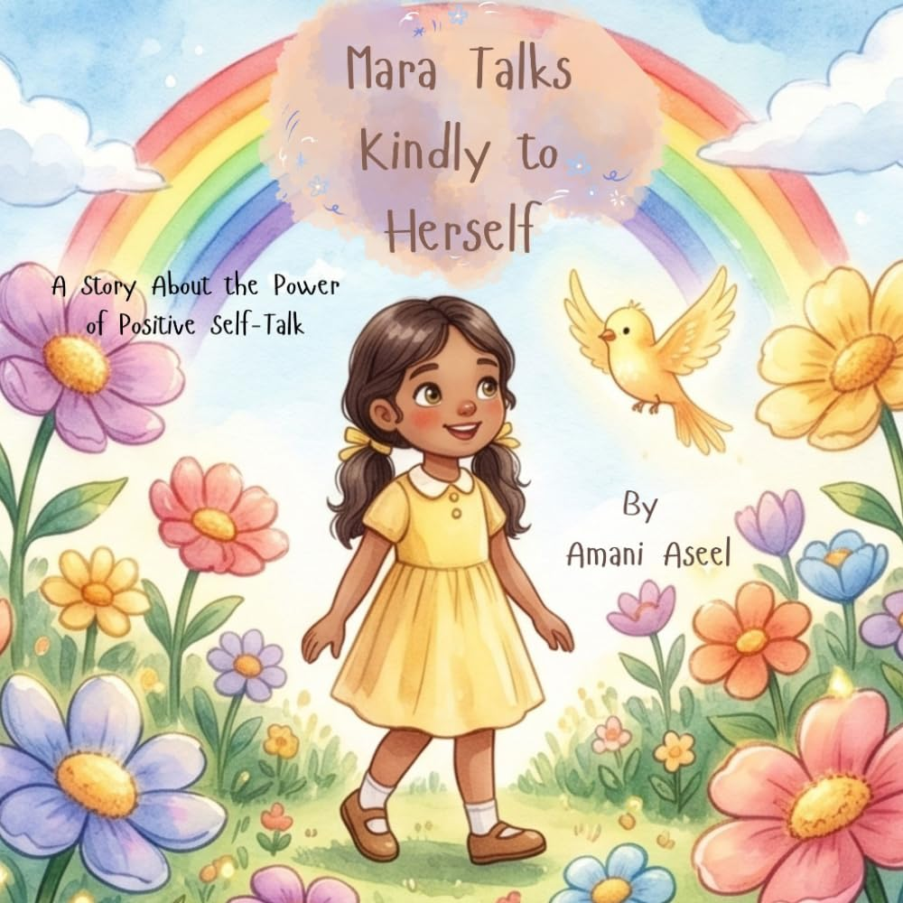

> [!TIP] **Available Now!** 
> Get your copy today from 
>  Amazon 

The first voice we hear in the morning is our own. So is the last one we hear at night.

What if children learned, from a very young age, just how much that voice matters?

**Mara Talks Kindly to Herself** is a gentle, uplifting story that introduces children to the power of positive self-talk, self-worth, and self-love, and gives them the words and the confidence to be their very own best friend.

Mara is often hard on herself. When she makes mistakes or feels unsure, her inner voice is not always kind. One day, her grandmother gives her a simple piece of advice: *"Speak to yourself the way you speak to your best friend."* As Mara begins practicing this new way of talking to herself, she learns to notice her inner conversations and discovers that kind words help her confidence, self-worth, and happiness grow.

Teaching children to speak kindly to themselves is a gift they can carry for a lifetime.




Mara Talks Kindly to Herself is a heartwarming story for children about the voice they hear most often: their own. When Mara makes mistakes or feels unsure, her inner voice can be harsh. With a simple piece of wisdom from her grandmother, she begins to treat herself the way she would treat her best friend. Through Mara's journey, children learn to notice their inner conversations and discover that kind words can help their confidence, self-worth, and happiness grow. It's a gentle reminder, for young readers and the grown-ups reading with them, that mistakes are part of learning.



Mara's grandmother gives her one sentence she can use anywhere: speak to yourself the way you speak to 
your best friend. After reading, invite your child to think of something they would say to a friend who 
made a mistake, and then try saying those same kind words to themselves. It's a small, repeatable 
moment that makes self-kindness feel natural instead of abstract.



<ul>
  <li>Want to help children practice <b>positive self-talk</b></li>
  <li>Are working with kids who are <b>hard on themselves</b> when they make mistakes or feel unsure</li>
  <li>Want to nurture a child's sense of <b>self-worth and self-love</b></li>
  <li>Cherish stories that highlight the <b>wisdom of grandparents</b></li>
  <li>Love stories that spark <b>meaningful conversations</b> at home or in the classroom</li>
  <li>Are looking for books that complement <b>social-emotional learning</b> at school or home</li>
</ul>




<ul>
    <li><b>Positive self-talk</b>: children learn that the way they speak to themselves matters. </li>
    <li><b>Recognizing your own worth</b>: kind inner words help a child's confidence and self-worth grow. </li>
    <li><b>Patience with yourself</b>: the story shows that being gentle with ourselves is a skill we can practice. </li>
    <li><b>Be your own best friend</b>: Mara learns to speak to herself like a friend she loves. </li>
    <li><b>Mistakes are part of learning</b>: getting things wrong is a normal step on the way to growing. </li>
    <li><b>Intergenerational wisdom</b>: a grandmother's simple advice becomes a tool Mara can use for life. </li>
</ul>





Amani's wish is to create meaningful stories that help children tend to their inner world, because what 
we carry within shapes how we experience the world around us. Her books are more than stories: they are 
lifelong lessons filled with ideas and tools that children can carry with them from childhood into 
adulthood. Her hope is simple: that every child grows with a healthy inner world, knows their worth, and 
has the confidence to let their light shine.



<b>What is "self-talk," and why does it matter for children?</b> 
Self-talk is the inner voice we all have. For children, learning early that this voice can be kind and 
encouraging helps build confidence and self-worth.
  
<b>Is this book only for children who are hard on themselves?</b> 
No. It's written for any child. Those who are especially self-critical, like Mara, may find it 
comforting, but the lesson about speaking kindly to ourselves is useful for every young reader.
  
<b>Who gives Mara her advice?</b> 
Her grandmother, who shares one simple sentence that changes how Mara talks to herself: "Speak to 
yourself the way you speak to your best friend."
  
<b>Can this book replace professional support?</b> 
It's a story, not a clinical tool. It works as a gentle conversation starter about feelings and 
self-kindness, and it's not a replacement for professional support.
  
<b>What age is this book written for?</b> 
It's written for young children, and works well as a read-aloud shared between an adult and a child.



