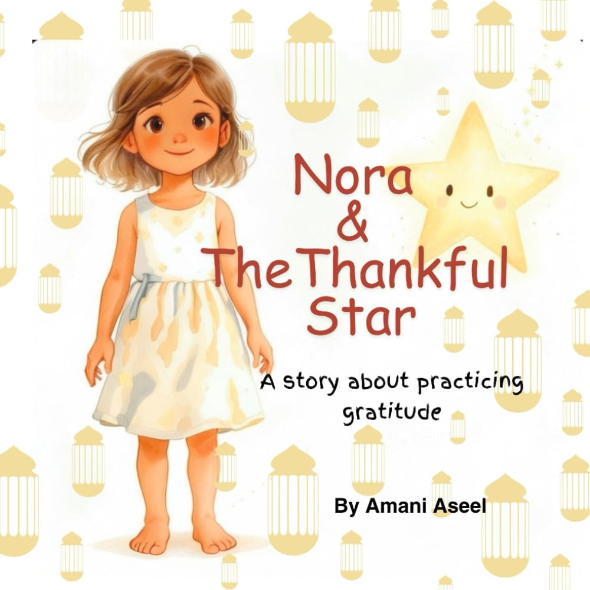

> [!TIP] **Available Now!** 
> Get your copy today from 
>  Amazon 

**Nora and the Thankful Star** is a story about gratitude practice.
When Nora looks up at the night sky, she wonders how wishes come true.
A wise, glowing star shares a gentle secret — the magic is in gratitude.
The more we are thankful for what we already have, the closer our wishes come to us.

Through this simple, heartwarming story, children learn to practice gratitude, count their blessings to keep a content, joyful heart.




Nora and the Thankful Star is a gentle, luminous story that introduces young readers to the <b>practice of gratitude</b>. 
When Nora gazes up at a glowing star and wonders how wishes come true, she receives a timeless lesson 
— that a thankful heart is a magnet for joy. 
Through warm, lyrical storytelling, children are invited to notice the blessings already surrounding them and 
discover that gratitude is not just something we feel, but something we practice every day.



Nora's habit of looking up and naming what she's thankful for is easy to carry off the page. Many families 
use the story as a launchpad for their own version — naming one or two things you're grateful for before 
lights out, the same way Nora looks to her star.



<ul>
  <li>Love <b>bedtime stories</b> with a meaningful message</li>
  <li>Are learning to appreciate the <b>little things</b> in life</li>
  <li>Need a gentle introduction to <b>gratitude practices</b></li>
  <li>Enjoy stories with a sense of <b>wonder and magic</b></li>
  <li>Want to nurture a <b>joyful, content heart</b> in their child</li>
</ul>




<ul>
    <li><b>Gratitude as a daily practice</b>: children learn that saying "thank you" goes beyond good manners; it's a way of seeing the world.</li>
    <li><b>Contentment over comparison</b>: the story gently teaches that happiness lives in what we already have. </li>
    <li><b>Wishes and intention</b>: Nora discovers that a grateful heart creates the conditions for dreams to grow. </li>
    <li><b>The beauty of the ordinary</b>: everyday moments become magical through a lens of appreciation. </li>
    <li><b>Emotional well-being</b>: counting blessings is shown as a simple, powerful tool for a joyful mind. </li>
</ul>





<b>Is this a book about wishing on stars, or about gratitude?</b> 
At heart it's about gratitude — the star is simply the gentle, wondrous voice that shares the lesson with 
Nora.
  
<b>Is this tied to any particular religion or belief system?</b> 
No. The story frames gratitude as something anyone can practice, without tying it to a specific faith or 
tradition.
  
<b>Can this be part of a nightly routine?</b> 
Yes — it pairs naturally with a bedtime routine, and many parents use it to introduce a simple "name one 
thing you're grateful for" habit before lights out.
  
<b>What age is this book written for?</b> 
It's a picture book for young children, told simply enough for early readers and cozy enough for a 
read-aloud at bedtime.



