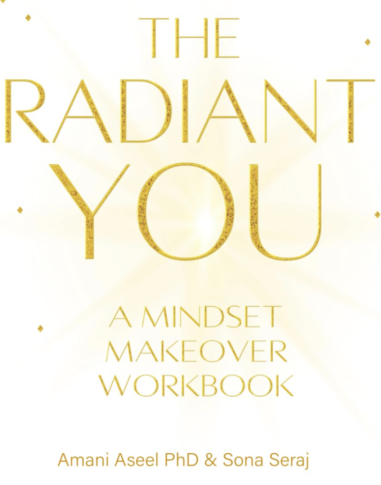

> [!TIP] **Available Now!** 
> Get your copy today from 
>  Amazon 

**The Radiant You: A Mindset Makeover Workbook** is your comprehensive guide to personal transformation. 
This beautifully crafted, interactive workbook takes you on a journey of self-discovery, helping you uncover 
your authentic self and unleash the radiance that's been waiting inside you all along. Every day you postpone 
investing in yourself is another day you're not living your fullest potential. 
Join thousands of others who've already begun their radiant transformation.




Unlike traditional self-help books that you simply read, this workbook engages you 
as an active participant in your transformation. Through carefully designed exercises, 
thoughtful prompts, and inspiring activities, you'll create lasting change from the inside out.



The workbook is organized into <b>8 Transformative Modules</b>, each building on the one before it — 
moving from self-assessment and mindset work into emotional resilience and, finally, the relationships 
around you. Every module pairs a short reflection with an exercise you complete directly on the page, so 
the ideas don't just stay in your head — they turn into something written, considered, and revisited.



<ul>
  <li>Want to make real, <b>lasting changes</b> in your life</li>
  <li>Prefer hands-on, interactive <b>learning</b></li>
  <li>Love beautiful, <b>inspiring design</b></li>
  <li>Need structure and guidance for <b>personal growth</b></li>
  <li>Want to discover your <b>authentic self</b></li>
  <li>Are ready to invest time in your <b>transformation</b></li>
  <li>Learn best by <b>writing things down</b>, not just reading about them</li>
</ul>




<ul>
    <li><b> Discover Your Authentic Self</b>: Self-assessment exercises and personal vision creation through <i>8 Transformative Modules</i>.</li>
    <li><b>Mindset Makeover</b>: Practice positive thinking and build confidence by identifying limiting beliefs and setting goals.</li>
    <li><b>Emotional Radiance</b>: Develop emotional intelligence and stress management techniques by integrating joy and gratitude in your lifestyle.</li>
    <li><b>Relationship Renewal</b>: Build connections and learn how to set boundaries with communication enhancement tools and purpose discovery exercises.</li>
    <li><b>Progress Over Perfection</b>: The modules are meant to be revisited, not finished once and shelved — transformation is treated as an ongoing practice.</li>
</ul>





<b>Do I have to complete the 8 modules in order?</b> 
The modules are designed to build on one another, so working through them in sequence gives the most 
complete experience — but you're welcome to start with whichever module speaks to you most right now.
  
<b>Do I need to write in the workbook itself, or can I use a separate journal?</b> 
The exercises are designed to be completed on the page, though if you'd rather keep this copy pristine, 
every prompt works just as well in a separate notebook.
  
<b>Is this only for people going through a crisis or major life change?</b> 
No. It's written for anyone who wants to be more intentional about their own growth — you don't need to 
be in crisis to benefit from a mindset makeover.
  
<b>How long does it take to work through?</b> 
There's no fixed timeline. Some readers move through a module a week; others prefer to slow down and sit 
with a single exercise for as long as it takes to feel complete.



