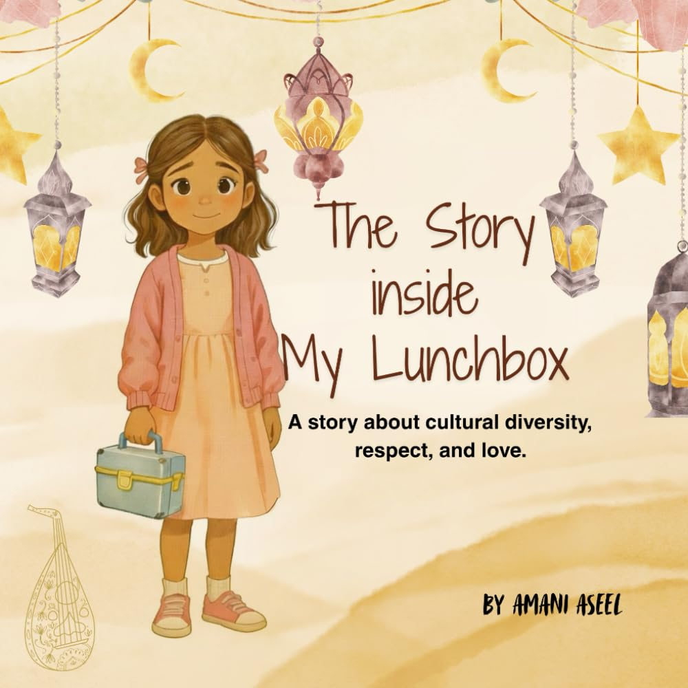

> [!TIP] **Available Now!** 
> Get your copy today from 
>  Amazon 

Every lunch box carries more than food—it carries love, care, and a story from home.

When a young girl proudly opens her lunch box at school, she’s excited to share her favorite meal made by her grandma. But when a classmate calls it “yucky,” her joy turns into tears. With courage and kindness, she learns to speak up, share the story behind her meal, and remind everyone that every lunchbox is special—because someone made it with love.

This touching and magical story helps children understand the beauty of cultural diversity, empathy, and respect.
It invites readers to celebrate differences, ask questions with kindness, and discover that every meal tells a story worth hearing.

A gentle story that opens hearts, one lunch box at a time.




The Story Inside My Lunchbox is a heartfelt celebration of cultural diversity, told through the most universal of experiences — a shared meal. When a young girl's cherished lunch from home is met with unkind words at school, she finds the courage to share not just her food, but the love and culture behind it. With empathy, warmth, and a touch of magic, this story reminds children that every family, every tradition, and every lunchbox carries a story worth honoring. It opens a door to conversations about kindness, belonging, and the richness of our differences.



<ul>
  <li>Celebrate <b>cultural diversity</b> and want to share that value with their child</li>
  <li>Are navigating experiences of <b>feeling different</b> or left out </li>
  <li>Want to inspire <b>empathy and respect</b> in young readers</li>
  <li>Love stories that spark <b>meaningful conversations</b> at home or in the classroom</li>
  <li>Believe in the power of <b>kindness</b> to build bridges between people</li>
</ul>




<ul>
    <li>🌍 <b>Cultural pride</b>: children are encouraged to be proud of their heritage and the traditions of home. </li>
    <li>👁️ <b>Empathy and perspective-taking</b>: the story invites readers to see the world through someone else's eyes before judging. </li>
    <li>🦁 <b>Courage to speak up </b>: the young girl models how to respond to hurtful words with grace and confidence. </li>
    <li>❤️  <b>Every family is special </b>: the message that love looks different in every home, and that's something to celebrate. </li>
    <li>🤝 <b>Inclusion and belonging</b>: the classroom becomes a richer, kinder place when everyone's story is welcomed. </li>
</ul>





