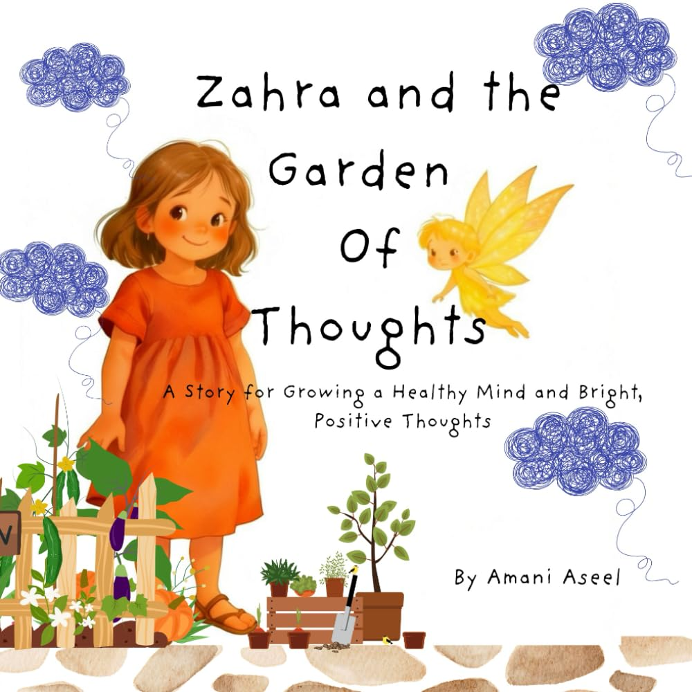

> [!TIP] **Available Now!** 
> Get your copy today from 
>  Amazon 

**Zahra and the Garden of Thoughts** is a magical story about a little girl who learns that her mind is just like a garden. Every thought she thinks becomes a seed — some grow into bright flowers of courage, joy, and calm, and others can turn into weeds of worry or doubt.

With the gentle guidance of Fairy Dot, Zahra learns how to plant good thoughts, pull out unhelpful ones, and choose the next positive thought one step at a time. As she cares for her inner garden, Zahra discovers that she can grow peace, confidence, and happiness from the inside out.

This heart-warming story teaches children the power of positive thinking, mindfulness, and emotional care. It helps young readers build a healthy mind, understand their feelings, and believe in their ability to make their inner world bloom — one thought at a time.




Zahra and the Garden of Thoughts invites children into a vivid, imaginative world where the mind is a garden — and every thought is a seed. With the playful guidance of Fairy Dot, young Zahra learns to tend her inner world: watering seeds of courage and joy, and gently pulling out the weeds of worry and doubt. This beautifully metaphorical story makes the concept of positive thinking accessible and memorable for children, giving them a tangible framework to understand their emotions and nurture a healthy, hopeful mindset — one thought at a time.



<ul>
  <li>Want to introduce children to <b>mindfulness and emotional health</b> in a fun, engaging way</li>
  <li>Are working with kids who experience <b>worry, anxiety, or self-doubt</b></li>
  <li>Love stories with <b>magical, imaginative settings</b> and meaningful lessons</li>
  <li>Want to teach children the <b>power of their own thoughts</b></li>
  <li>Are looking for books that complement <b>social-emotional learning</b> at school or home</li>
</ul>




<ul>
    <li><b>The mind as a garden</b>: a rich, child-friendly metaphor that makes abstract emotional concepts concrete and relatable. </li>
    <li><b>Positive thinking as a skill</b>: children learn that thoughts can be chosen, nurtured, and changed. </li>
    <li><b>Emotional awareness</b>: Zahra's journey helps young readers name and understand their own feelings. </li>
    <li><b>Self-compassion</b>: the story gently teaches that unhelpful thoughts are not bad; they just need to be redirected. </li>
    <li><b>Inner resilience</b>: children are empowered to grow peace, confidence, and happiness from within themselves. </li>
</ul>





